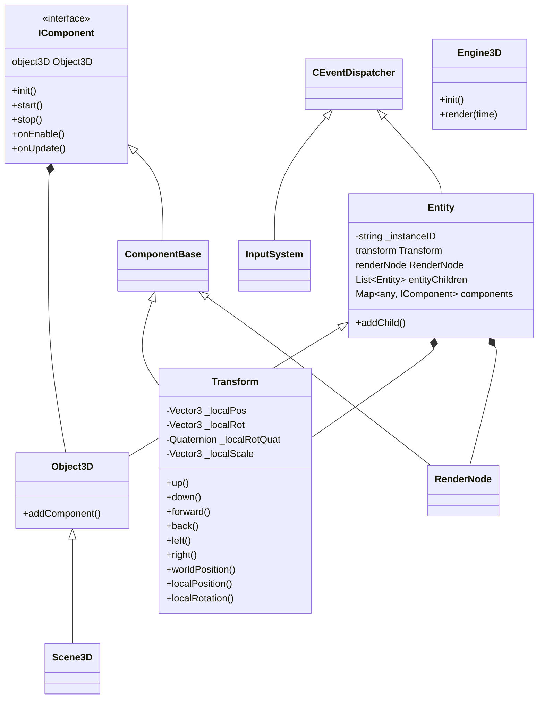

```mermaid
classDiagram
  class IComponent {
    <<interface>>
    object3D Object3D
    +init()
    +start()
    +stop()
    +onEnable()
    +onUpdate()
  }
  class ComponentBase {
  }

  class Transform {
    -Vector3 _localPos
    -Vector3 _localRot
    -Quaternion _localRotQuat
    -Vector3 _localScale

    +up()
    +down()
    +forward()
    +back()
    +left()
    +right()
    +worldPosition()
    +localPosition()
    +localRotation()
  }

  class RenderNode {
  }

  class CEventDispatcher {

  }

  class InputSystem {
  }


  class Entity {
    -string _instanceID

    transform Transform
    renderNode RenderNode
    List~Entity~ entityChildren
    Map~any, IComponent~ components

    +addChild()
  }

  class Object3D {
    +addComponent()
  }
  class Scene3D {
  }


  class Engine3D {
    +init()
    +render(time)
  }

  IComponent *-- Object3D
  IComponent <|-- ComponentBase

  ComponentBase <|-- Transform
  ComponentBase <|-- RenderNode

  CEventDispatcher <|-- InputSystem

  CEventDispatcher <|-- Entity
  Entity <|-- Object3D
  Entity *-- Transform
  Entity *-- RenderNode
  Object3D <|-- Scene3D


```
